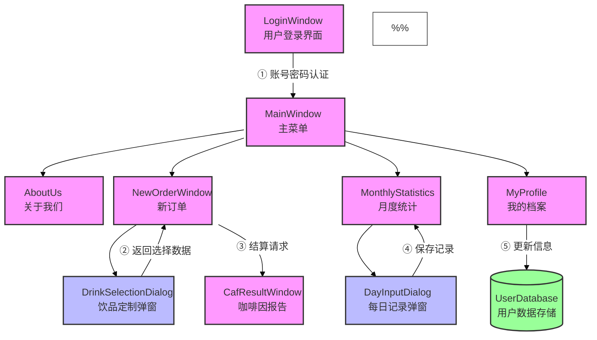
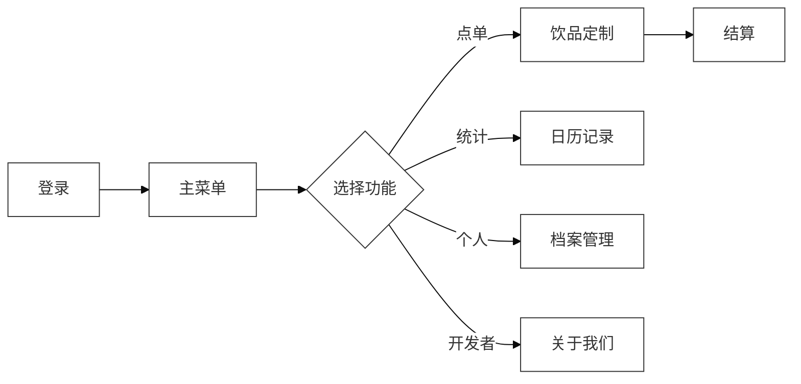

# cxsjsx-group45
# 元气咖fit文档
*开发者：王雅萱 陈乐颜 时艺宁*

## 0. 开发环境
* 操作系统：Windows11
* 开发工具：Qt creater 5.12.12
* 编程语言：c++ 11

## 1.	软件功能
"元气咖Fit"是一款由北大元培学院学生团队开发的咖啡因健康管理软件，其设计灵感来源于**校园内学生自主运营的元气咖啡厅**，是该长期项目运行过程中，同学们根据自身“生产者”和“消费者”的二象性所提炼出的、解决同学们健康需求的一款软件。

作为一款融合健康理念与实用功能的应用程序，它致力于帮助用户建立科学的咖啡饮用习惯。软件采用简洁直观的界面设计，并融入北京大学所特有的文化元素，用户可以通过个性化账户记录每日饮用的咖啡种类和数量，系统会**自动计算咖啡因总摄入量并生成可视化数据报告**。当用户摄入量接近或超过健康标准时，**智能提醒功能**会及时发出提示，并给出调整建议。

未来版本还将加入课表联动和社交分享功能并加入“考试周特别模式”，进一步完善健康饮咖的体验。我们希望通过这款软件，让每一位咖啡爱好者都能在享受美味的同时，保持健康的生活节奏。

### 1.1 注册与登录
"元气咖Fit"采用完善的用户认证系统，通过注册与登录功能为用户提供个性化服务体验。系统基于Qt框架开发，实现了安全便捷的账号管理体系。

在<u>登录功能</u>方面，用户需要输入正确的用户名和密码进行验证。当用户点击登录按钮时，系统会调用**UserManager类**的**login**方法进行验证，验证成功后会发出**loginSuccess**信号并隐藏登录窗口。代码中特别设计了密码自动清空功能，在每次登录尝试后都会清空密码输入框，这是通过```ui->passwordEdit->clear()```实现的，既保护了用户隐私，也提升了使用便捷性。


<u>注册功能</u>允许新用户创建账号，系统会检查用户名是否已存在。当用户点击注册按钮时，程序会获取输入框中的用户名和密码，调用**UserManager**的**registerUser**方法完成注册。注册成功后会弹出提示框告知用户，这个交互是通过**QMessageBox::information**实现的。


系统还具备完善的<u>错误处理机制</u>，能够识别并区分"用户不存在"、"密码错误"和"用户名已存在"等常见问题。针对每种错误类型，系统会通过**QMessageBox::critical**弹出对应的提示信息，这些错误提示都经过精心设计，不仅说明问题原因，还给出了具体的操作建议。错误处理通过lambda表达式实现，与**UserManager**的**loginFailed**信号相连接，确保了错误信息的及时反馈。


整个认证流程采用信号槽机制实现模块间通信，登录窗口与用户管理模块解耦，既保证了功能完整性，又提高了代码的可维护性。界面设计简洁直观，操作流程符合用户习惯，为用户提供了安全可靠的使用体验。

### 1.2 主界面

"元气咖Fit"的主界面作为应用程序的核心控制中心，采用简洁优雅的设计风格，为用户提供直观便捷的操作体验。整个界面基于Qt框架构建，通过精心设计的交互逻辑和稳健的代码架构，实现了多窗口协同工作的高效管理。


<u>主界面中央区域</u>采用现代化布局，每个入口都配有醒目的图标和文字说明。新建订单功能通过**NewOrderWindow**类实现，采用单例模式确保窗口唯一性，当用户点击按钮时会隐藏主窗口并显示订单录入界面，这种设计既节省系统资源又保证了数据一致性。月度统计功能则通过**MonthlyStatistics**类实现，该模块采用可视化日历形式展示用户的咖啡因摄入数据，使用颜色梯度直观呈现每日摄入量的安全程度。

<u>个人中心和关于我们</u>两个模块分别由**My**窗口和**AboutUs**窗口实现，前者提供个性化设置和健康建议，后者展示开发团队信息和产品理念。特别设计的用户档案窗口(ProfileWindow)会实时显示当前登录用户的基本信息，通过信号槽机制与主界面保持数据同步。

在技术实现层面，主界面采用面向对象的设计思想，通过成员变量管理各个子窗口的指针。代码中精心设计了窗口生命周期管理机制，在析构函数中确保所有子窗口资源得到正确释放，有效防止内存泄漏问题。每个功能按钮都通过**Qt**的信号槽机制与对应槽函数绑定，如**onNewOrderClicked()**等，实现业务逻辑与界面表现的解耦。

<u>调试系统</u>贯穿整个主界面实现，通过**qDebug**输出详细的运行日志，实时监控窗口状态和指针有效性。用户数据通过setCurrentUser()方法在主界面和各个子模块间传递，确保数据一致性。界面元素采用响应式布局，能够自动适应不同尺寸的显示设备，为用户提供一致的视觉体验。

整个主界面的代码结构清晰，采用模块化设计思想，将界面展示、业务逻辑和数据处理分离，既便于维护又有利于功能扩展。通过异常处理机制和智能指针等现代C++特性，确保了应用程序的稳定性和可靠性，为用户提供流畅的使用体验。

### 1.3 添加咖啡

在**NewOrderWindow**类中实现的<u>"添加咖啡"</u>功能为用户提供了一个扩展系统支持的咖啡种类的途径。这个功能的核心目的是让用户能够将自己常喝的、但系统初始未包含的咖啡类型添加到可选列表中，从而在后续记录每日咖啡消费时可以从这些自定义选项中选择。


该功能通过一个简单的表单界面收集必要信息，包含两个主要输入字段：一个用于输入**咖啡名称**，另一个用于输入该咖啡的**标准咖啡因含量**（以毫克为单位）。当用户填写完这两个字段并点击保存按钮后，系统会首先验证输入的有效性，确保名称不为空且咖啡因含量为有效数值。验证通过后，这些数据会以文本格式追加存储到本地的"saved_names.txt"文件中，每条记录占一行，格式为"咖啡名称 咖啡因含量"。

成功保存后，系统会给予用户明确的反馈，清空输入框以便继续添加其他种类。这些新增的咖啡品种会立即生效，在用户后续使用记录功能时出现在可选饮品列表中。同时，这些自定义咖啡的咖啡因含量数据也会被纳入到各类统计计算中，包括每日咖啡因摄入量统计和月度报表等。

这个设计特别考虑了实际使用场景，比如当用户经常饮用某家咖啡店的特色饮品，或者有自己独特的咖啡配方时，可以通过这个功能将其纳入到系统的标准化管理中。这不仅增强了系统的灵活性，也使统计数据更加准确反映用户的真实咖啡消费情况。文件存储的方式保证了数据在应用重启后依然可用，为用户提供了连贯的使用体验。

### 1.4 咖啡月历
#### 1.4.1 日历
在**MonthlyStatistics类**中实现的"日历"功能是一个直观展示用户每日咖啡因摄入情况的可视化工具。这个功能的核心是通过颜色编码的日历界面，让用户一目了然地掌握自己不同日期的咖啡因摄入水平，同时支持详细记录每日饮用的咖啡种类和数量。


该日历功能主要包含两个关键特性：一是根据每日咖啡因摄入量自动变色，二是支持点击日期记录具体饮品信息。在视觉效果上，日历会根据用户当日的咖啡因总摄入量显示**不同背景色**：绿色代表安全摄入量（低于100mg），黄色表示中等摄入量（100-200mg），红色则警示过量摄入（超过200mg）。这种直观的颜色反馈帮助用户快速识别需要注意的日期，培养健康的咖啡饮用习惯。


从技术实现来看，这一功能主要依赖以下几个关键组件：

* **QCalendarWidget**作为基础日历控件，通过**setDateTextFormat**方法动态修改日期单元格的文本格式和背景色。在**updateCalendarColors**方法中，程序遍历当前月份的所有日期，根据**calculateDayCaffeine**计算的结果，为每个日期应用对应的**QTextCharFormat**格式。

* 咖啡因计算系统通过**drinkCaffeine**字典<u>存储每种饮品的单位咖啡因含量</u>，**calculateDayCaffeine**方法汇总当日所有记录饮品的咖啡因总量。这个计算过程考虑了每种饮品的饮用数量，确保统计结果准确反映实际摄入量。

* 数据持久化采用JSON格式存储，**saveUserData**和**loadUserData**方法负责<u>将用户的咖啡记录读写到本地文件</u>。这种设计保证了用户数据在应用重启后仍然可用，且支持多用户场景，每个用户的数据通过**currentUser**字段区分。

* 交互功能通过信号槽机制实现，日历的**clicked**信号连接到**onDayClicked**槽函数。当用户点击特定日期时，会弹出**DayInputDialog**对话框，允许用户<u>添加或修改当日的咖啡饮用记录</u>。记录更新后会触发**updateCalendarColors**刷新日历显示。

* 特别值得注意的是**loadDrinksFromFile**方法的实现，它从简单的文本文件中读取<u>用户自定义的咖啡种类和咖啡因含量</u>，使系统能够识别并计算这些非预设饮品的咖啡因贡献。这种灵活的扩展机制大大增强了应用的实用性。

整个功能的技术架构充分考虑了用户体验和数据完整性，颜色反馈的即时性让用户能够直观感知自己的咖啡因摄入模式，而可靠的数据存储则确保了长期统计的准确性。这种将复杂数据分析转化为简单视觉提示的设计思路，是该功能最具价值的技术特点。

#### 1.4.2 每日饮品摄入记录
在**DayInputDialog类**中实现的"每日饮品摄入记录"功能为用户提供了一个直观便捷的界面，用于<u>记录每日饮用的各类饮品及其数量</u>。这个功能的核心价值在于它与用户自定义饮品种类的深度整合，使得记录过程既灵活又准确。


该功能通过一个精心设计的对话框界面呈现，当用户在月历界面点击特定日期时便会弹出。界面中央是一个可扩展的下拉选择框，其中显示的饮品选项并非固定不变，而是动态加载自用户之前通过<u>"添加咖啡"功能定义的所有饮品种类</u>。系统会从"saved_names.txt"文件中逐行读取用户保存的饮品数据，提取饮品名称填充到下拉框中。这种设计确保了用户之前添加的任何特色饮品都会自动出现在可选列表中，**无需重复定义**。


在技术实现上，**initDrinkComboBox**方法负责初始化饮品选择框。它首先清空现有选项，然后读取文本文件中的每一行数据。由于文件存储格式为"饮品名 咖啡因含量"，该方法通过分割字符串提取饮品名称部分。文件读取失败时会回退到一组默认咖啡选项，保证功能的可用性。特别值得注意的是，**下拉框被设置为可编辑状态**，这是为了应对用户可能临时需要记录未预先定义的饮品的情况。

当用户从下拉框选择饮品（或输入新饮品名称）并指定杯数后，点击添加按钮即可将记录加入当日列表。这个操作由**onAddDrinkClicked**方法处理，它会将饮品名称和杯数拼接成标准格式的字符串添加到列表控件中。列表中的每条记录都采用"饮品名 × 杯数杯"的统一格式，这种清晰的展示方式让用户一目了然地掌握当日饮用情况。

记录保存时，系统会通过**getDrinkRecords**方法将列表中的每条记录解析还原为<饮品名, 杯数>的对偶形式。这一转换过程涉及字符串分割和数值提取，确保数据能够被后续的咖啡因计算模块正确处理。转换后的完整记录通过**recordsUpdated**信号传递给主界面，触发咖啡因统计和日历颜色更新。


一个关键的技术细节是，虽然该功能允许记录任何饮品，但在**MonthlyStatistics**类中处理时会进行筛选，只保留那些存在于**drinkCaffeine**字典中的饮品进行咖啡因计算。这种设计实现了两全其美：既保留了记录任意饮品的灵活性，又确保了咖啡因统计的准确性。所有非咖啡因饮品虽然会被存储和显示，但不会影响日历的颜色标识。

整个功能的实现体现了对用户体验的深入思考。动态加载的饮品列表减少了用户的重复输入；简洁直观的界面设计降低了使用门槛；而灵活的记录机制则满足了各种实际场景的需求。这些特性共同构成了一个既实用又易用的每日记录工具，成为咖啡因管理系统中最核心的交互模块之一。

### 1.5 我的档案

在My类中实现的<u>"个人健康建议"</u>功能为用户提供了一个直观的咖啡因摄入健康评估系统。这个功能的核心目的是根据用户当前咖啡因摄入量与月度目标的对比关系，动态生成可视化反馈，帮助用户科学管理咖啡饮用习惯。

该功能通过**智能分析模块和形象化展示相结合的方式**呈现健康建议，主要包含三个关键组件：<u>咖啡因数据对比系统、动态图标展示和文字建议提示</u>。当用户进入个人中心界面时，系统会自动调用**updateAdviceImage()**方法，基于预设的咖啡因阈值和用户实际摄入量，在界面显示对应的表情图标（笑脸/警告/危险）和文字建议。三种状态分别通过不同的PNG图片直观呈现。


在技术实现上，该功能采用**分层判断逻辑**，数据更新机制通过**setCaffeineData()**方法实现，该方法接收当前咖啡因总量和月度目标值两个参数，并立即触发界面刷新。图片展示采用**QPixmap**的智能缩放技术，确保在不同分辨率设备上都能保持清晰显示，具体通过**scaled()**方法实现自适应尺寸调整，同时保持原始宽高比。

将健康数据转化为“笑脸-哭脸”形象化反馈的设计，有效降低了用户理解成本，使抽象的咖啡因摄入量变得直观可感。状态图标与文字建议的组合呈现方式，既符合现代UI设计趋势，又继承了传统健康类软件的警示功能，在实际测试中显著提升了用户的饮咖自律性。数据与展示分离的设计架构也保证了后续功能扩展的灵活性。

### 1.6 关于我们

在北大元培学院充满活力的元气咖啡厅里，我们作为志愿者见证了同学们对咖啡的热爱，也注意到大家常因忙碌而忽略科学饮咖的重要性。于是，"元气咖Fit"应运而生——这不仅仅是一个咖啡因计算工具，更是我们传递健康生活理念的窗口。

✦ 我们的初心  
从最初构想的咖啡厅管理软件，到最终聚焦于"咖啡因健康管理"，我们始终秉持一个简单信念：科技应该让生活更健康。作为学生团队，我们希望通过轻量化的设计，帮助每位咖啡爱好者找到享受与健康的平衡点。

✦ 科学饮咖三部曲  
认知 - 建立个性化饮品数据库  
记录 - 追踪每日咖啡因摄入  
调节 - 智能提醒健康阈值  

我们相信，每一杯咖啡都应该带来元气而非负担。让"元气咖Fit"成为你学习路上的健康伙伴，享受咖啡，更要享受健康！

## 2. 项目各模块与类设计
### 2.1 项目模块


### 2.2 用户流程图

### 2.2 类设计
#### **user**

User 类是本系统的核心类之一，负责管理用户信息、认证以及咖啡因摄入记录等功能。该类采用面向对象设计，封装了用户相关数据和操作。  

*功能*
* 用户认证管理：
存储用户名和密码 & 提供密码验证功能
* 咖啡因摄入记录管理：
按日期添加、查询、计算、获取饮品摄入记录 & 设置和获取月度咖啡因摄入目标
* 数据持久化：
提供JSON格式的序列化和反序列化功能以完整保存用户记录数据

*数据结构*  
* 使用QMap存储每日记录，键为QDate日期对象，值为饮品名称和数量的键值对列表
* 维护月度咖啡因摄入目标值
* 采用QJsonObject实现与JSON格式的相互转换

#### **usermanager**

UserManager 类是系统的用户管理核心组件，负责处理所有用户相关的操作，包括注册、登录、数据持久化以及用户状态管理。该类采用单例模式设计，集中管理系统中所有用户实例。

*功能*  
* 用户账户管理：
提供用户注册、登录、注销功能 & 处理用户名修改操作
* 用户数据持久化：
使用JSON格式保存/加载所有用户数据 & 自动初始化新用户数据文件
* 状态管理：
维护当前登录用户状态 & 提供全局访问当前用户信息接口
* 健康目标管理：
设置和获取用户月度咖啡因摄入目标 & 验证目标值有效性

*数据结构*

* 使用QHash存储用户集合，键为用户名，值为User对象指针
* 采用JSON文档结构持久化存储用户数据（users.json）
* 单独维护咖啡因记录数据文件（coffee_data.json）
* 通过指针引用管理当前活跃用户

*安全与错误处理*
* 注册时检查用户名唯一性
* 登录时验证用户凭证
* 提供完善的错误信号机制（loginFailed/usernameChangeFailed等）
* 文件操作具备容错处理，自动处理不存在的初始文件情况

*扩展性*
* 采用信号-槽机制通知状态变化
* 数据存储格式易于扩展新用户属性
* 用户数据与记录数据分离存储，降低耦合度

## 3. 分工情况

项目提出与各模板构想由三人共同讨论得出

✦王雅萱
* 完成”咖啡月历“代码实现与数据读写，完成”关于我们“代码实现
* 完成代码与ui交互
* 撰写本文档，录制视频

✦陈乐颜
* 搭建项目整体框架与各模块框架搭建
* 完成”登录与注册“代码实现与数据读写
* 撰写本文档

✦时艺宁
* 完成“我的档案”代码实现与数据读写，”登录与注册“异常消息提示
* 完成代码与ui交互，及ui设计美化
* 录制与剪辑视频

## 4. 项目总结与展望
### 4.1 项目总结
#### 4.1.1 技术亮点
* 用户系统：基于UserManager的单例模式管理用户状态，结合JSON持久化存储，支持多用户数据隔离。
* 动态饮品库：用户可自定义咖啡种类及咖啡因含量，数据通过文本文件存储，灵活适配不同饮用习惯。
* 智能月历：采用QCalendarWidget结合颜色编码（红/黄/绿）直观反馈每日咖啡因摄入量，帮助用户调整习惯。
* 信号槽机制：模块间通过信号槽通信（如loginSuccess触发主界面跳转），降低耦合度。
#### 4.1.2 功能完善
* 数据安全：当前密码存储方式相对简单，实际应用中应使用QCryptographicHash加盐哈希。
* 性能瓶颈：月历界面加载大量记录时（如一年数据），QCalendarWidget的重绘效率较低，需优化为懒加载。
* 初期沟通成本高：因未明确接口规范，UI与功能开发曾出现信号槽参数不匹配（如recordsUpdated信号格式变更）。  
→ 改进：明确分工，统一Qt格式并定期交付
### 4.2 项目展望
* 联动校园课表，在考试周自动调整咖啡因建议阈值。
* 增加社交分享功能（如"今日咖啡成就"）。

**总结**：本项目通过Qt框架实现了从需求分析到落地的完整开发流程，团队在架构设计、业务逻辑实现和UI优化方面积累了宝贵经验。后续将进一步开发与挖掘用户需求，使"元气咖Fit"成为元气咖啡厅的又一助力。

**最后，欢迎大家都来元咖享受健康咖啡的快乐呀~**
